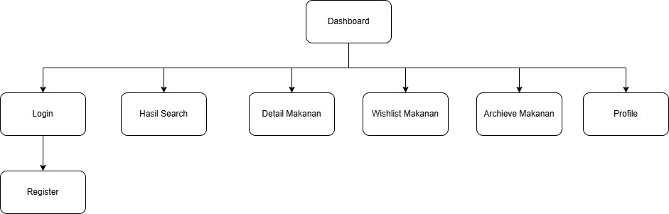
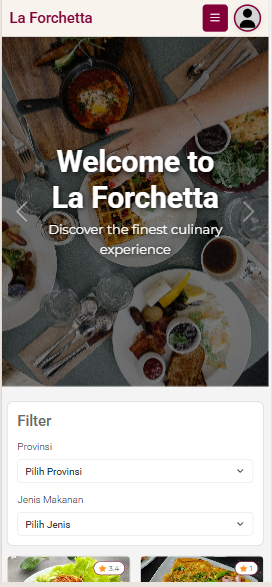
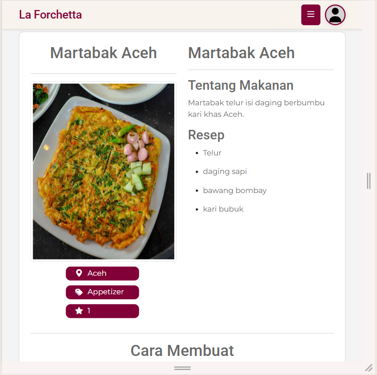
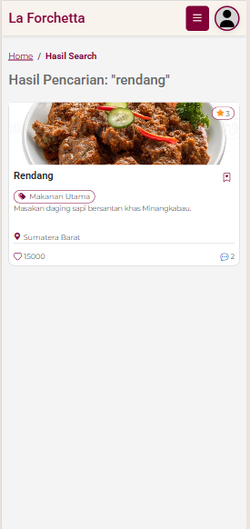
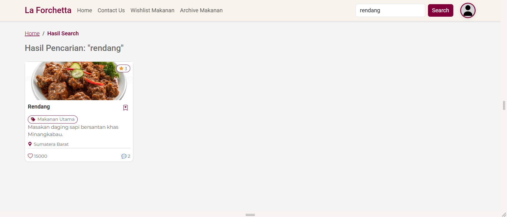
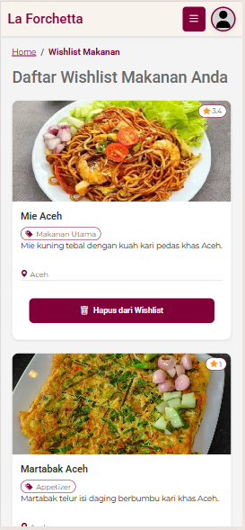

# Dokumentasi Tugas Besar Design Web (A)

## **La Forchetta**

---

## 1. Identitas Proyek

**Nama Proyek:**  
La Forchetta

**Deskripsi Proyek:**  
La Forchet adalah sebuah website review makanan yang dirancang untuk membantu pengguna menemukan informasi dan ulasan berbagai jenis makanan. Website ini menampilkan daftar makanan, detail makanan, serta fitur rating dan review yang memungkinkan pengguna berbagi pengalaman mereka. Perancangan La Forchet berfokus pada struktur antarmuka, konsistensi visual, serta prinsip desain web yang baik dan mudah dipahami.

**Kelompok:** 8

**Anggota Kelompok:**

- Fatimah – 4524210039
- Herlyana Ferdiani – 4524210042
- Inna Lutfiah Fatih – 4524210044
- Jevrene Samny Pratama – 4524210046
- Muhammad Edvin Hidayat – 4524210054
- Belvaria Hendriyani – 4524210078

---

## 2. Teknologi yang Digunakan

- **HTML5**  
  Digunakan untuk membangun struktur halaman dengan elemen semantik seperti header, nav, main, section, dan footer guna meningkatkan aksesibilitas.

- **CSS3**  
  Digunakan untuk mengatur tampilan dan layout website.

- **Bootsrap 5**  
  Digunakan sebagai framework utama untuk membangun layout yang responsif dan konsisten. Bootstrap dipilih karena menyediakan sistem grid, komponen UI siap pakai, serta mendukung desain adaptif pada berbagai ukuran layar.

- **JavaScript**  
  Digunakan untuk interaksi antarmuka seperti pencarian makanan, navigasi dinamis, dan simulasi review.

- **JSON**  
  Digunakan sebagai sumber data statis untuk menampilkan informasi makanan dan review.

---

## 3. Daftar Fitur

- **Login**  
  Digunakan untuk autentikasi pengguna yang telah memiliki akun.

- **Register**  
  Digunakan untuk mendaftarkan akun baru bagi pengguna.

- **Profile**  
  Menampilkan informasi akun pengguna.

- **Dashboard**  
  Menampilkan informasi umum dan rekomendasi makanan.

- **Detail Makanan**  
  Menampilkan informasi lengkap mengenai makanan yang dipilih.

- **Search & Filter**  
  Memudahkan pengguna mencari makanan berdasarkan nama atau kategori.

- **Review & Rating**  
  Menampilkan ulasan dan penilaian makanan.

---

## 4. Struktur Halaman (Sitemap)

---

## 5. Bukti Responsivitas & Tampilan

### 5.1 Dashboard

**Mobile**  

**Tablet**  

**Desktop**  

---

### 5.2 Detail Makanan

**Mobile**  

**Tablet**  

**Desktop**  

---

### 5.3 Hasil Pencarian

**Mobile**  

**Tablet**  

**Desktop**  

---

### 5.4 Login

**Mobile**  

**Tablet**  

**Desktop**  

---

### 5.5 Register

**Mobile**  

**Tablet**  

**Desktop**  

---

### 5.6 Profile

**Mobile**  

**Tablet**  

**Desktop**  

---

### 5.7 Wishlist Makanan

**Mobile**  

**Tablet**  

**Desktop**  

---

### 5.8 Archieve Makanan

**Mobile**  

**Tablet**  

**Desktop**  

---

## 6. Bukti Aksesibilitas

Berikut merupakan hasil pengecekan aksesibilitas pada website La Forchetta:

**Dashboard**  

**View Details**  

**Login**  

**View Register**  

**Profile**  

**Wishlist Makanan**  

**Archieve Makanan**  

**Hasil Search**  

---

## Penutup

Website **La Forchet** dikembangkan sebagai bagian dari Tugas Besar mata kuliah Desain Web dengan menerapkan prinsip UI/UX, aksesibilitas, responsivitas, serta penggunaan framework Bootstrap 5. Proyek ini diharapkan mampu merepresentasikan website profesional yang inklusif dan nyaman digunakan di berbagai perangkat. TERIMAKASIH!

---
